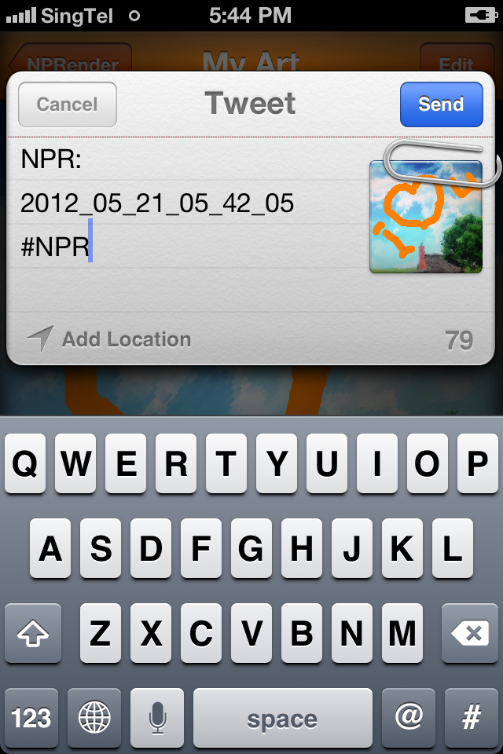

# ios-non-photorealistic-rendering

iOS NPR application that a wide variety of expressive styles for digital art

# Description

The iOS allows user to take photos (as shown in the screenshots below) and turn them into expressive arts. 

Once the photo is taken, the user can uses the NPR editor in the app to refine the image style art 

The user can also draw on the image

The completed art work can then be saved to the NPR library as shown here:

The completed art can then be shared in social network

